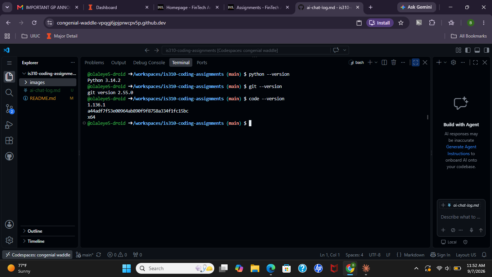

# Init IS310 Homework
## Proof of Installation
1. Python

2. Git

3. VS Code

4. bolaleye
5. AI Tool/Workflow
Throughout the semester I may use ChatGPT to either troubleshhot erros or explain complex ideas that I may not understand.